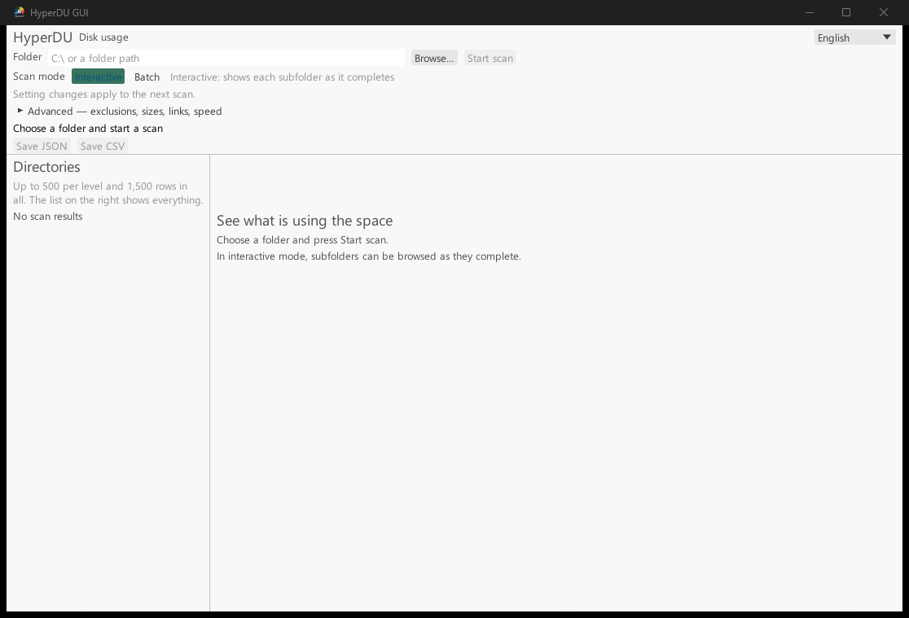

# hyperdu-gui

[日本語](README.md) · **English** · [简体中文](README.zh-CN.md)



A Windows / Linux desktop interface for exploring disk usage. It reuses `hyperdu-core`, the same scanner as the CLI and MCP server. The UI is available in Japanese, English and Simplified Chinese and starts in the OS display language (English for any other). Switch at any time with the selector at the top right, or choose the startup language with `HYPERDU_LANG` (`ja` / `en` / `zh`). Startup searches OS fonts for CJK, emoji, and other fallbacks; the Chinese UI on Linux needs a font with Simplified Chinese, such as `fonts-noto-cjk`.

## Install

This README ships with `0.5.0-beta.6` ([website](https://hyperdu.automation.jp/)). Use the GUI binaries in [GitHub Releases](https://github.com/automationjp/HyperDiskUsage/releases/tag/v0.5.0-beta.6), or install from crates.io. Running a prebuilt binary does not require Rust.

```bash
cargo install hyperdu-gui --locked --version 0.5.0-beta.6
hyperdu-gui
```

For a development checkout, run from the repository root:

```bash
cargo install --locked --path hyperdu-gui
cargo run --release -p hyperdu-gui
```

Use a recent stable Rust for source builds. Current GUI source declares Rust 1.85 and checks that floor on Linux / Windows. Published beta manifests remain immutable; install the published package with a recent stable toolchain. Linux needs X11 / Wayland development libraries; Windows needs its build environment and a desktop session. macOS is not a current GUI release target. [Setup](../docs/en/setup.md) · [Minimum-version caveat (Japanese)](../docs/developer-guide.md)

## Operation and delivery modes

Enter a path in 「対象フォルダ」 or choose it with 「選択…」, select a mode and settings, then press 「スキャン開始」. Settings apply to the next scan and cannot change during an active scan. 「中止」 requests cooperative cancellation.

**Interactive (default)** first lists the root, reporting direct-file totals and pending child folders. It then scans one child folder at a time with all workers and delivers completed results. Unlike waiting for the entire scan, this lets you explore completed folders while remaining work runs. It is not a filesystem watcher.

**Batch** receives the aggregate map as one result. A successful MFT scan requested in Interactive mode also delivers a batch result, explicitly indicated by the UI.

## Settings

| Control | Behavior |
|---|---|
| Substring / glob / regex | One pattern per line; trims whitespace and empty lines. Invalid regex fails at scan start |
| Minimum file size | Integer plus B / KB / KiB / MB / MiB / GB / GiB. Decimal units use 1000; binary units use 1024. Whitespace and case are normalized |
| Depth limit | `0` means unlimited; positive values are relative to the original scan root |
| Follow links | Follows symlinks with cycle detection |
| Count hard links separately | Default deduplicates; enabling counts each link |
| Same filesystem only | Does not cross the root filesystem boundary |

### Size accounting is separate from I/O policy

**Physical + logical (default)** computes allocation and logical file sizes. **Logical only** skips physical accounting and uses logical size as the physical-column substitute. **Approximate (fast)** prioritizes reduced metadata I/O rather than exact file sizes: regular files with minimum size zero currently use a 4096-byte estimate, and directory entries use zero. The UI labels approximate results. Do not interpret substituted physical values as allocated bytes.

| I/O control | Behavior |
|---|---|
| Thread count | `0` uses the core default. Positive values request workers; Gentle caps the effective count at two |
| Balanced | Default; preserves correct accounting without deliberately warming the cache |
| Throughput | Uses available I/O more aggressively |
| Gentle | No readahead; limits workers and large-directory splitting |
| Readahead auto / on / off | Delegate to the profile or select explicitly; readahead can increase total bytes read |
| Large-directory yield interval | Split/yield every N entries; `0` disables it; range `0..=1,000,000` |

Windows MFT scanning is opt-in and requires NTFS, a volume root, administrator privileges, and supported options. Incomplete required reads or parsing fall back to enumeration. Success does not guarantee complete accounting parity with enumeration. [MFT boundaries](../docs/en/architecture.md)

## Display limits, errors, and export

The left tree renders at most 500 entries per opened directory and 1500 rows overall. This does not discard scan results. The right table covers all children of the selected directory and renders visible rows; sort by physical size, logical size, file count, or name. Deep directories remain accessible through the table.

Direct files are shown as a separate total, not a synthetic directory. Rows show physical / logical sizes. Progress includes processed files, remaining folders, and error counts; up to 20 error details are displayed.

Read errors, cancellation, and scan failures are not successful completion. Completed partial results remain viewable after cancellation, but synchronous I/O is not guaranteed to stop immediately. JSON / CSV export is enabled only after `Finished`, with zero errors and no active scan.

In current source, an export worker handles the native dialog, row copy, sort, and write. The UI hands off a constant-time shared snapshot and stays available for browsing. Failed writes and cancellation observed before replacement preserve the previous destination. New scans and duplicate exports are blocked until completion. Cancellation does not instantly interrupt OS I/O, sorting, or an open dialog. This source change does not update already published binaries. [Architecture](../docs/en/architecture.md)

## Other entry points

For scripts, CI, and AI integration, use [hyperdu CLI / MCP](../hyperdu/README.en.md). For embedding in Rust, see the [developer guide (Japanese)](../docs/developer-guide.md).

## License

MIT. Fonts bundled through egui dependencies retain their OFL-1.1 and Ubuntu-font-1.0 licenses.
