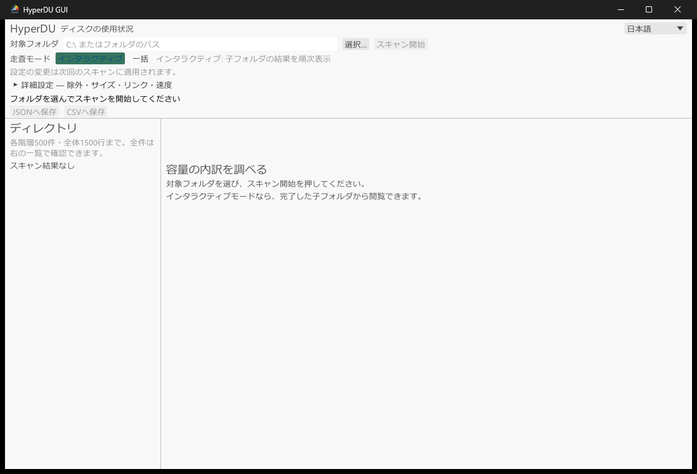

# hyperdu-gui

**日本語** · [English](README.en.md) · [简体中文](README.zh-CN.md)



ディスク使用量をツリーと一覧で調べる、Windows / Linux向けのデスクトップGUIです。独自の走査処理を持たず、CLI / MCPと共通の `hyperdu-core` を使います。画面は日本語・英語・簡体字中国語に対応し、OSの表示言語で始まります（それ以外の言語は英語）。右上の選択欄でいつでも切り替えられ、環境変数 `HYPERDU_LANG`（`ja` / `en` / `zh`）で起動時の言語も指定できます。起動時にOSのフォントからCJK・絵文字などのfallbackを探します。Linuxで中国語表示を使う場合は、簡体字を含むフォント（`fonts-noto-cjk` など）が必要です。

## 公開済みベータ版の導入

**0.5.0-beta.5 は公開済みです。** [GitHub Release](https://github.com/automationjp/HyperDiskUsage/releases/tag/v0.5.0-beta.5)のGUIバイナリ、またはcrates.ioから導入できます。バイナリの実行にRustは不要です。

```bash
cargo install hyperdu-gui --locked --version 0.5.0-beta.5
hyperdu-gui
```

開発checkoutを使う場合はリポジトリルートで実行します。

```bash
cargo install --locked --path hyperdu-gui
cargo run --release -p hyperdu-gui
```

ソースビルドには新しいstable Rustを使ってください。現在のGUIソースはRust 1.85を最低版とし、Linux / Windowsで確認します。公開済みベータ版の古いmanifestは変更されないため、公開版の導入には新しいstableを使用します。LinuxにはX11 / Waylandの開発ライブラリ、Windowsには通常のデスクトップセッションとビルド環境が必要です。macOSは現行GUI Releaseの対象外です。[セットアップ](../docs/setup.md) · [最低版の注意](../docs/developer-guide.md#6-正確性と対応範囲を誤解しない)

## 操作と結果の届け方

「対象フォルダ」へ入力するか「選択…」でフォルダを選び、走査モードと必要な詳細設定を選んで「スキャン開始」を押します。設定は次回の走査に適用され、走査中は変更できません。「中止」は協調的なキャンセルです。

**Interactive（既定）** は最初にルート直下を列挙し、直下ファイル合計と子フォルダのpending状態を通知します。続いて子フォルダを一つずつ全ワーカーで走査し、完了したものから表示します。全走査の終了を待つGUIと異なり、残りの走査中にも完了済みフォルダを閲覧できます。常時監視やファイル変更への自動追従ではありません。

**Batch** は全体の集計mapをまとめて受け取ります。MFT経路がInteractive要求で成功した場合も一括配送となり、そのことを画面に表示します。

## 詳細設定

| 設定 | 意味 |
|---|---|
| 文字列 / glob / 正規表現 | 1行に1パターン。前後の空白と空行を除き、不正な正規表現は開始時にエラー |
| 最小ファイルサイズ | 整数と B / KB / KiB / MB / MiB / GB / GiB。KB等は1000倍、KiB等は1024倍。空白と大小文字を正規化 |
| 深さ上限 | `0` は無制限。正の値は元の走査ルート基準の制限 |
| リンク先を走査 | symlinkを追跡し、循環検出を有効化 |
| ハードリンクを個別に数える | 既定は重複排除。有効にすると各リンクを別に計上 |
| 同じファイルシステムのみ | 走査ルートのファイルシステム境界を越えない |

### サイズ計算とI/Oを分けて選ぶ

**物理＋論理（既定）** は割当サイズとファイルの論理サイズを集計します。**論理のみ** は物理計算を省き、物理欄にも論理サイズを代替表示します。**概算（高速）** は正確なファイルサイズを優先せず、最小サイズ0の通常ファイルでは現在4096 bytesを推定値として使い、ディレクトリエントリは0として扱います。画面には概算結果と表示します。論理のみ・概算の物理欄を実割当サイズとして扱わないでください。

| I/O・並列設定 | 意味 |
|---|---|
| スレッド数 | `0` はコア既定。正の値は要求数。Gentleでは有効数を最大2に制限 |
| Balanced / 標準 | 既定。正しい結果を保ち、意図的なcache warmをしない |
| Throughput / 速度優先 | 利用可能なI/Oを積極的に使う |
| Gentle / 低負荷 | 先読みをせず、ワーカー数と巨大ディレクトリ分割を抑える |
| 先読み 自動 / 有効 / 無効 | profileに任せるか、明示的に指定。先読みは読む総量を増やす場合がある |
| 巨大フォルダの分割間隔 | Nエントリごとに分割してyield。`0` は無効、指定範囲は `0..=1,000,000` |

WindowsのMFT直接走査は任意選択です。NTFS・ボリュームルート・管理者権限・対応オプションが必要で、不完全な必須読み取りや解析では通常列挙へ戻ります。成功しても通常列挙との完全な集計一致を保証しません。[MFTの境界](../docs/architecture.md#optional-mft-path)

## 表示上限、エラー、保存

左ツリーは開いたディレクトリごとに最大500件、画面全体で最大1500行まで描画します。これは結果を捨てる制限ではありません。右の一覧は選択ディレクトリの全子ディレクトリを対象にし、可視行を描画します。物理サイズ・論理サイズ・ファイル数・名前で並べ替えでき、深い階層にも一覧から移動できます。

直下のファイルは仮想ディレクトリにせず「直下のファイル合計」として表示します。各行のサイズは物理 / 論理です。進捗には処理済みファイル、残りフォルダ、エラー数を表示し、エラー詳細は最大20件を表示します。

読み取りエラーがある終了、キャンセル、走査失敗を成功完了とは扱いません。キャンセル時は完了済みの部分結果を閲覧できますが、同期I/Oの即時停止は保証しません。JSON / CSV保存は `Finished`、エラー0、走査中でない場合だけ有効です。

現在のソースでは、exportのダイアログ・全行の複製・ソート・書き込みを専用ワーカーで実行します。UIは共有スナップショットを定数時間で渡し、保存中も閲覧できます。保存失敗や置き換え前に確認したキャンセルでは既存ファイルを維持します。保存中の新規走査・二重保存は抑止します。同期I/O・ソート・開いているOSダイアログの即時中断は保証しません。この変更は公開済みバイナリを更新するものではありません。[実装と配送の詳細](../docs/architecture.md)

## CLI・MCP・Rustとの使い分け

スクリプト、CI、AI連携には [hyperdu CLI / MCP](../hyperdu/README.md)を、Rustへの組み込みには [開発者ガイド](../docs/developer-guide.md)を参照してください。

## ライセンス

MIT。eguiの依存に同梱されるフォントには、それぞれOFL-1.1とUbuntu-font-1.0のライセンスが適用されます。
