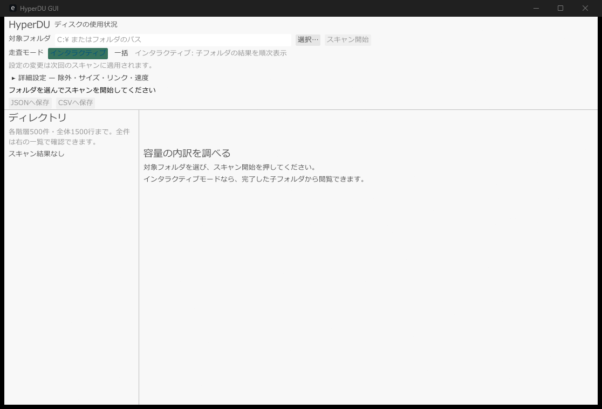

# hyperdu-gui

[日本語](README.md) · [English](README.en.md) · **简体中文**



`hyperdu-gui` 是使用共享 scanner core 检查磁盘使用量的桌面 GUI。可以输入目标路径或选择文件夹，然后随着结果到达逐步查看目录明细。

GUI 中的标签、状态消息和设置项均为日语。启动时会搜索操作系统的字体目录，并注册 CJK、emoji、UI 和等宽字体 fallback，因此可以显示包含日语字符的路径。native startup 的日语渲染已经确认。

## 发布状态

`0.5.0-beta.3` 正在准备发布。发布后才能从 crate registry 安装指定版本。目前请从仓库 root 安装 source checkout。

## 安装与启动

在仓库 root 执行：

```bash
cargo install --locked --path hyperdu-gui
hyperdu-gui
```

从 development checkout 启动：

```bash
cargo run --release -p hyperdu-gui
```

Linux 需要 `eframe` / `winit` 使用的 X11 或 Wayland development libraries。Windows 需要普通 desktop session。macOS 目前不属于 GUI release target。Rust 版本、系统依赖和构建步骤请参见[环境配置](../docs/zh-CN/setup.md)。

## 界面与扫描流程

1. 在“目标文件夹”中输入路径，或使用“选择…”选择文件夹
2. 选择“扫描模式”
3. 按需修改详细设置
4. 点击“开始扫描”
5. 在左侧目录 tree 和右侧列表中查看结果

设置会应用于下一次扫描。扫描进行时目标和设置不可修改。“中止”按钮会请求 cooperative cancellation。

### Interactive 与 Batch

`Interactive` 是默认模式。core 首先列出 root 直下的内容，并报告直下文件的汇总以及 pending 子文件夹。随后让所有 worker 一次扫描一个子文件夹，并在每个子文件夹完成后更新 GUI。剩余扫描继续时，已经完成的文件夹仍可查看。

`Batch` 一次接收完整的结果 map。它用于扫描完成后显示整体结果，不用于在扫描过程中逐个显示子文件夹结果。

Windows MFT 路径在 interactive scan 中成功时，GUI 会提示正在接收一次批量结果，而不是通常的逐子文件夹结果。

## 详细设置

| 设置 | 行为 |
|---|---|
| 名称/路径包含 | literal contains filter。每行一个 pattern；会忽略首尾空白和空行 |
| glob | glob filter。每行一个 pattern；会忽略首尾空白和空行 |
| 正则表达式 | regex filter。每行一个 pattern；会忽略首尾空白和空行。不合法的 regex 会在扫描开始时报告错误 |
| 最小文件大小 | 输入整数及 `B / KB / KiB / MB / MiB / GB / GiB`。KB/MB/GB 使用 1000 倍，KiB/MiB/GiB 使用 1024 倍。忽略空格且不区分大小写 |
| 最大深度 | `0` 表示无限制。正数以原始 scan root 为基准 |
| 追踪链接 | 追踪 symlink，并启用 link-cycle detection |
| 单独计算 hardlink | 默认关闭，像 GNU `du` 一样对 hardlink 去重；开启后每个 hardlink 分别计数 |
| 仅限同一 filesystem | 不越过 scan root 所在 filesystem 的边界 |

### 大小计算

- **物理 + 逻辑**（默认）：计算 allocation/physical size 和 logical file size。
- **仅逻辑**：跳过 physical-size 计算，并在物理列显示 logical size 作为替代值。
- **概算（更快）**：跳过 physical-size 计算，并估算 regular-file size 以减少 metadata I/O。当最小大小为 0 时，当前 regular-file fast path 使用 4 KiB（4096 bytes）作为估算值，并将 directory entry 按 0 处理。它不优先保证 file size 的精确性，GUI 会将结果标为概算；物理列同样是替代值。

在仅逻辑和概算模式下，不要把物理列解释为实际 allocation size。

### 速度与 I/O

| 设置 | 行为 |
|---|---|
| 线程数 | `0` 使用 core 的 default thread 数。正数请求对应数量的 worker。Gentle 会将有效数量限制为最多 2 个 |
| I/O 标准 | **Balanced**：保持结果正确，不刻意 warm page cache |
| I/O 速度优先 | **Throughput**：尽可能使用 hardware 能提供的 I/O |
| I/O 低负荷 | **Gentle**：关闭 readahead，减少 worker 和大型 directory 分割，尽量不妨碍其他工作 |
| 预读 自动 | 由 I/O profile 决定 |
| 预读 启用 / 禁用 | 显式打开或关闭 readahead。readahead 可以降低 latency，但会增加读取总量，因此除非明确要求，默认关闭 |
| 大型目录分割间隔 | 每 `N` 个 entry 分割大型 directory 并 yield。`0` 表示禁用；GUI 接受 `0..=1,000,000` |

### Windows MFT

“尝试直接扫描 NTFS MFT”是 Windows 专用的 opt-in 设置。它需要管理员权限、NTFS、volume root 和整个 volume 的扫描。如果无法安全完整解析 MFT layout、进程没有提权、volume 不是 NTFS，或目标不是整个 volume，HyperDU 会回退到普通 directory enumeration，而不会返回部分结果。

MFT 路径报告的是 volume 自身的 view，而不是用户通过 filesystem 看到的 view，因此默认永远不启用。成功时，interactive GUI 会显示一次批量结果。

## 结果显示

### 左侧 tree

每个展开的 directory 最多显示 500 个子项，整个视图的 recursive rendering 最多显示 1,500 行。更深层的 directory 仍可通过右侧列表访问。这些是渲染限制，不会删除扫描结果。

### 右侧列表

列表显示选中 directory 的**全部**子项。可以按物理大小、逻辑大小、文件数或名称排序。每个 directory 500 项和整个 tree 1,500 行的限制不适用于此列表。

root 直下的文件显示为**直下文件总计**。GUI 不会创建可能与 directory 结果混淆的 virtual path。

每一行显示 `physical / logical`。在仅逻辑和概算模式下，physical 值是前面说明的替代值。

## 状态、错误与取消

- 扫描时，pending 子文件夹显示 spinner；状态区显示已扫描 files、剩余 folders 和 error 数。
- 读取错误会增加 error count；最多保留并显示 20 条详细信息。
- 如果 core 在存在错误时发出完成事件，GUI 会显示结果，但将其标为 partial，不视为 complete。
- “中止”请求 cooperative cancellation。已完成文件夹的部分结果仍可查看，但取消的扫描不会报告为完成。
- root 不存在、pattern 或 size 不合法、scan thread 失败等情况会显示错误状态。

只有在扫描发出 `Finished`、error count 为 0 且当前没有扫描运行时，JSON 和 CSV 保存按钮才会启用。partial、cancelled 和 failed 结果不能导出。

## 普通 CLI / MCP

GUI 是可视化和交互式 front-end。脚本、CI、structured output 或 AI agent 请使用普通的 `hyperdu` CLI 和 `hyperdu mcp`。安装和 MCP 注册请参见 [hyperdu CLI / MCP README](../hyperdu/README.zh-CN.md)。

## 许可证

MIT。egui dependency chain 中捆绑的字体分别带有自己的 OFL-1.1 和 Ubuntu-font-1.0 许可证。
