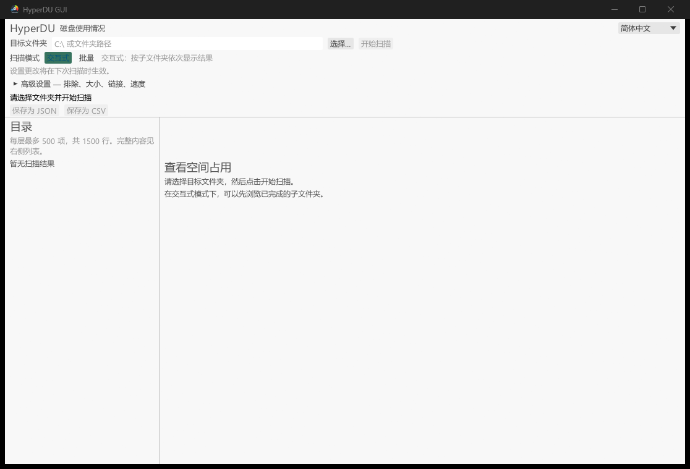

# hyperdu-gui

[日本語](README.md) · [English](README.en.md) · **简体中文**



用于探索磁盘使用量的 Windows / Linux 桌面界面。它复用 CLI / MCP 使用的 `hyperdu-core`，不另写扫描引擎。界面支持日语、英语和简体中文，启动时使用操作系统的显示语言（其他语言显示为英语）。可随时通过右上角的选择框切换，也可用环境变量 `HYPERDU_LANG`（`ja` / `en` / `zh`）指定启动语言。启动时从系统字体中寻找 CJK、emoji 等回退字体；在 Linux 上使用中文界面需要包含简体中文的字体（如 `fonts-noto-cjk`）。

## 安装

本 README 对应 `0.5.0-beta.6`（[网站](https://hyperdu.automation.jp/)）。可使用 [GitHub Release](https://github.com/automationjp/HyperDiskUsage/releases/tag/v0.5.0-beta.6) 的 GUI 二进制文件，或从 crates.io 安装。运行预构建二进制文件不需要 Rust。

```bash
cargo install hyperdu-gui --locked --version 0.5.0-beta.6
hyperdu-gui
```

开发 checkout 请在仓库根目录执行：

```bash
cargo install --locked --path hyperdu-gui
cargo run --release -p hyperdu-gui
```

源码构建请使用较新的 stable Rust。当前 GUI 源码声明最低 Rust 1.85，并在 Linux / Windows 检查；已发布 Beta 包的 manifest 不会改变，安装公开包请使用较新的 stable。Linux 需要 X11 / Wayland 开发库，Windows 需要构建环境及桌面会话。macOS 不在当前 GUI Release 范围内。[环境设置](../docs/zh-CN/setup.md) · [最低版本说明（日语）](../docs/developer-guide.md)

## 操作与结果交付

在「対象フォルダ」中输入路径，或通过「選択…」选择目录；设置模式后点击「スキャン開始」。设置仅用于下一次扫描，扫描中不能更改。「中止」请求协作式取消。

**Interactive（默认）** 先枚举根目录，报告直属文件合计和待扫描子目录，再用全部工作线程依次扫描每个子目录，逐步交付完成结果。不必等待整个扫描结束，就能查看已完成的目录。这不是持续监视文件变化的 watcher。

**Batch** 一次性交付整体汇总 map。Interactive 请求成功使用 MFT 时也会交付批量结果，并在界面明确提示。

## 设置

| 选项 | 行为 |
|---|---|
| 子串 / glob / 正则表达式 | 每行一个模式，去除首尾空白与空行。无效正则在开始时报错 |
| 最小文件大小 | 整数及 B / KB / KiB / MB / MiB / GB / GiB。十进制单位为1000倍，二进制单位为1024倍；规范化空白及大小写 |
| 深度上限 | `0` 为无限制，正值相对于原扫描根目录 |
| 跟随链接 | 跟随 symlink，并检测循环 |
| 单独统计硬链接 | 默认去重，启用后分别统计每个链接 |
| 仅同一文件系统 | 不跨越扫描根的文件系统边界 |

### 大小统计与 I/O 策略分开选择

**物理＋逻辑（默认）** 计算分配大小和文件逻辑大小。**仅逻辑** 跳过物理统计，物理列也用逻辑值代替。**估算（快速）** 优先减少元数据 I/O 而不是精确大小；最小大小为0的普通文件当前使用4096字节估算，目录项为0，界面会标记为估算结果。不要将替代的物理列解释为实际分配字节。

| I/O 选项 | 行为 |
|---|---|
| 线程数 | `0` 使用核心默认值；正值为请求线程数，Gentle 将有效数量限制到最多2 |
| Balanced | 默认，保持正确统计，不主动预热缓存 |
| Throughput | 更积极使用可用 I/O |
| Gentle | 不预读，限制线程数和大目录拆分 |
| 预读 自动 / 开 / 关 | 由 profile 决定或显式选择；预读可能增加总读取量 |
| 大目录拆分间隔 | 每 N 项拆分并 yield，`0` 为关闭，范围 `0..=1,000,000` |

Windows MFT 扫描需手动启用，要求 NTFS、卷根目录、管理员权限及受支持的选项。必要读取或解析不完整时回退到普通枚举。成功也不保证与普通枚举的统计完全一致。[MFT 边界](../docs/zh-CN/architecture.md)

## 显示限制、错误与导出

左侧树对每个展开目录最多绘制500项，整体最多1500行；这不会丢弃扫描结果。右侧列表覆盖当前目录的全部子目录，仅绘制可见行，可按物理大小、逻辑大小、文件数或名称排序。仍可通过列表进入深层目录。

直属文件作为独立合计显示，不构造虚拟目录。每行大小为物理 / 逻辑。进度包括处理文件数、剩余目录和错误数；错误详情最多显示20项。

读取错误、取消和扫描失败不视为成功完成。取消后仍可查看已完成的部分结果，但不能保证立即中断同步 I/O。只有收到 `Finished`、错误数为0且没有活动扫描时，才允许 JSON / CSV 导出。

当前源码在导出工作线程中处理原生对话框、行复制、排序和写入。UI 以常数时间交付共享快照，保存期间仍可浏览。写入失败或替换前观察到取消时保留旧文件；完成前禁止新扫描与重复保存。取消不会立即中断 OS I/O、排序或已打开的对话框。此源码变更不会更新已发布二进制文件。[架构](../docs/zh-CN/architecture.md)

## 其他入口

脚本、CI 和 AI 集成请用 [hyperdu CLI / MCP](../hyperdu/README.zh-CN.md)。Rust 集成见[开发者指南（日语）](../docs/developer-guide.md)。

## 许可证

MIT。通过 egui 依赖包含的字体保留其 OFL-1.1 和 Ubuntu-font-1.0 许可证。
